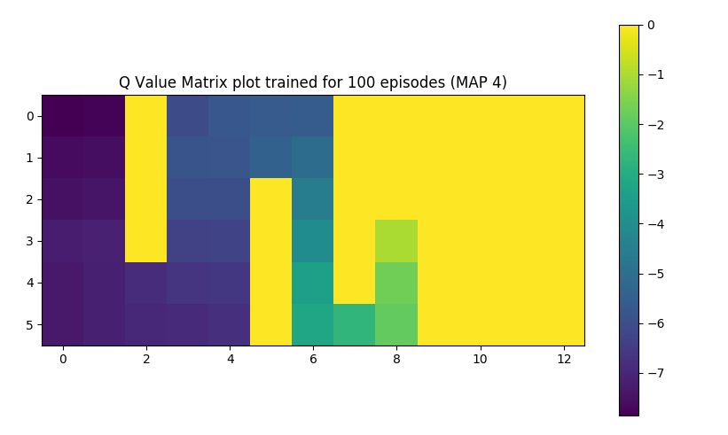

# Reinforcement-Learning---Q-Learning
Using Q-Learning on MAP 4 of the grid world environment

Monte Carlo approaches fails for maps bigger than MAP 2. Q learning overcomes this limitation. And Q learning also does exrememly well in terms of convergence rate. We begin to observe positive rewards from as early as the 200th episode for MAP 4.
The performance can be seen in the plot below, the graph is extremely noisy due to perpetual exploration. 

The heat map of the Q values for MAP 4 is visualized below during it's journey to convergence. We can see that how the states near the goal have the highest value. 

Plot when trained for 0 episodes: 
Plot when trained for 10 episodes: 
Plot when trained for 100 episodes: 
Plot when trained for 500 episodes: 

Note: In order to visualize the simulation of the agent reaching the goal for MAP 4 please keep all the files in the same folder and run main.py only. If you need to simulate the environment for any other MAP make sure to change the MAP4 to MAP3 or MAP2 in main.py 
